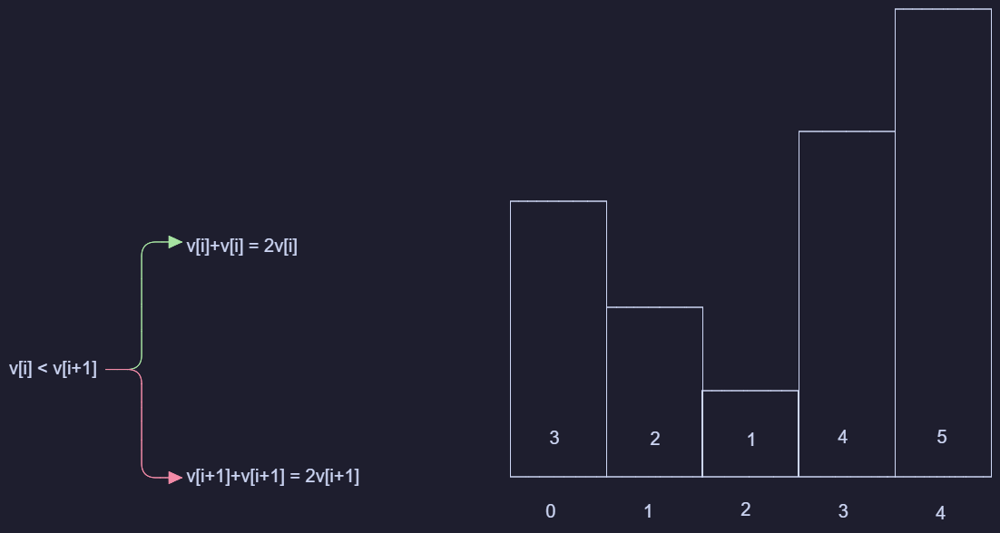
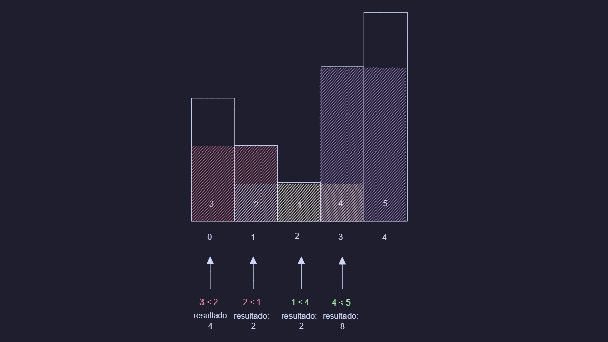
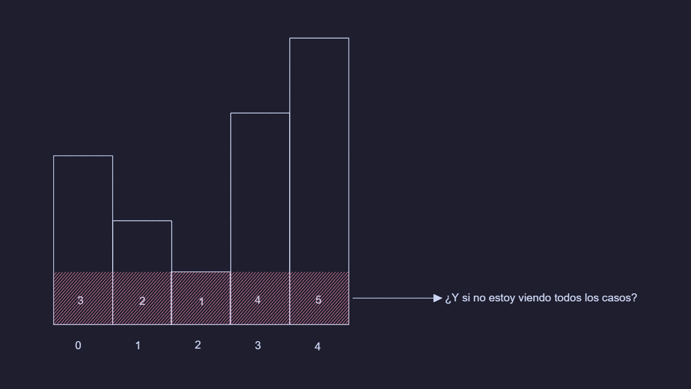

### Prueba de Avance

Este archivo será un "diario" en el cual iré escribiendo mi avance según pase los días, al cual le puse de nombre "MyREADME" porque colocaré mis ideas principales, cómo he ido pensando el problema, qué cosas he descubierto en el transcurso de los días según mi investigación e incluso errores que detecto en mi lógica a la hora de avanzar. Todo redactado a mano por mi. 

#### Día 1

Mi idea principal se limitaba a solo ver a la derecha sin expandir más de una vez, es decir solo se verificaba i con i+1, lo cual ayudaba a encontrar más rectángulos y no solo los de "ancho 1" pero no eran todos los casos. 

Ahí es donde me empecé a preguntar: ¿Qué pasa si la mínima altura multiplicado por el número de rectángulos de ancho 1 en el histograma es en verdad el rectángulo con más área? Entonces me di cuenta que estaba perdiendo casos. 

