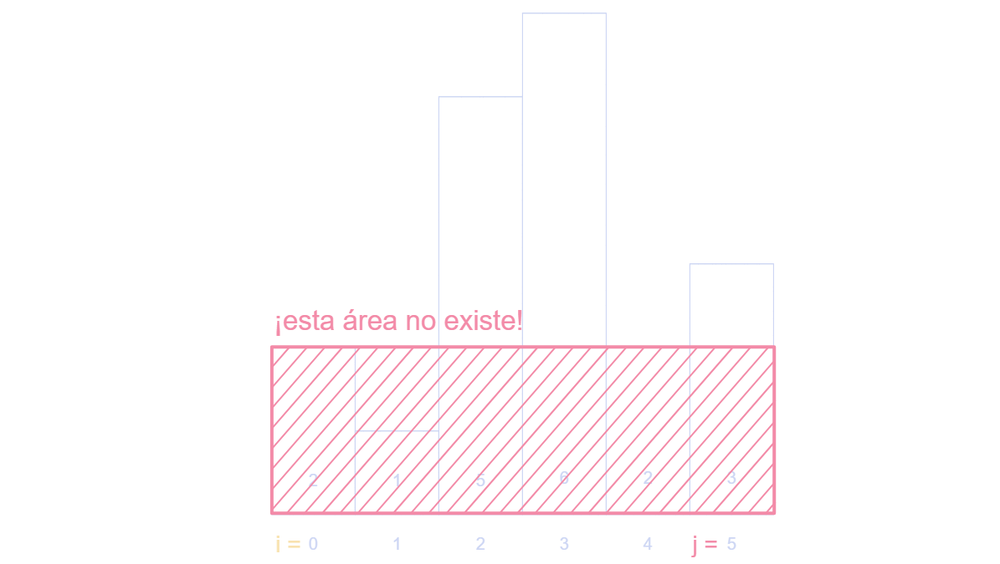
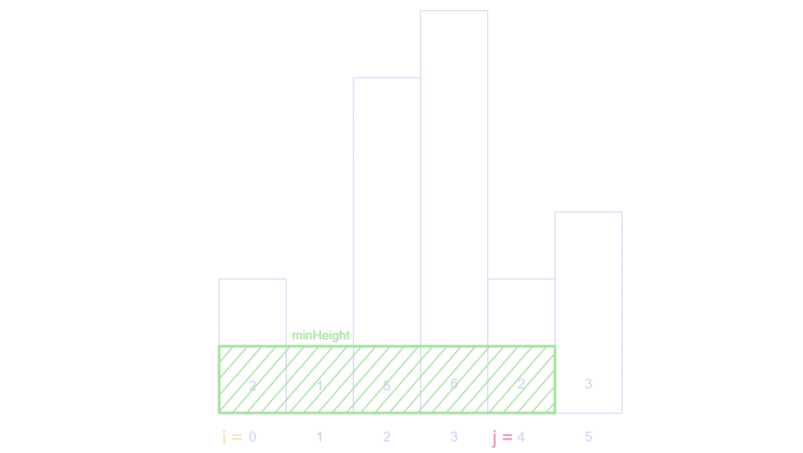
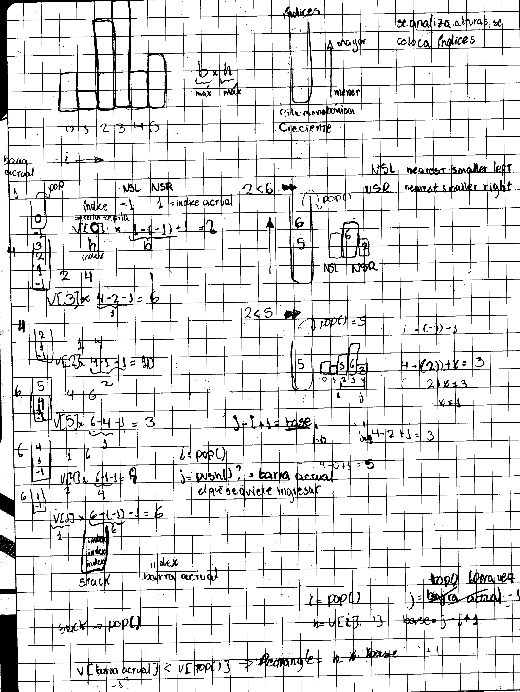
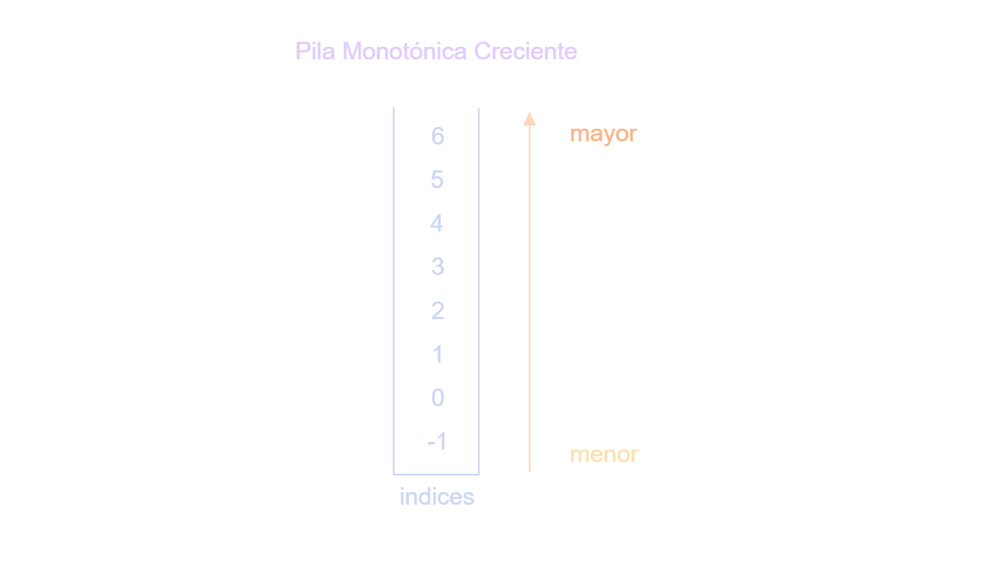
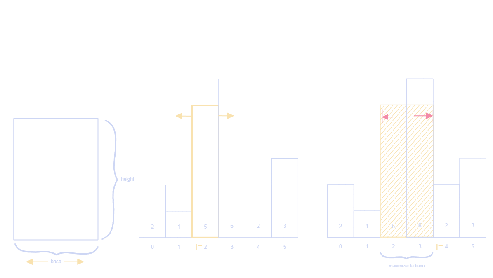

### Prueba de Avance

Este archivo será un "diario" en el cual iré escribiendo mi avance según pase los días, al cual le puse de nombre "MyREADME" porque colocaré mis ideas principales, cómo he ido pensando el problema, qué cosas he descubierto en el transcurso de los días según mi investigación e incluso errores que detecto en mi lógica a la hora de avanzar. Todo redactado a mano por mi. 

#### Día 1

Mi idea principal se limitaba a solo ver a la derecha sin expandir más de una vez, es decir solo se verificaba i con i+1, lo cual ayudaba a encontrar más rectángulos y no solo los de "ancho 1" pero no eran todos los casos. 

Ahí es donde me empecé a preguntar: ¿Qué pasa si la mínima altura multiplicado por el número de rectángulos de ancho 1 en el histograma es en verdad el rectángulo con más área? Entonces me di cuenta que estaba perdiendo casos. 

#### Día 2

Aprovechando que venía de la clase de hoy lunes 2026-04-27 comencé a pensar cómo podría alcanzar todos los casos posibles. En lo que se me ocurrió lo siguiente:
- Usaría un índice i.
- Usaría un índice j. 

La idea es dejar el índice i fijo e ir "scaneando" los rectángulos existentes hacia la derecha, si choca con uno de ancho uno y altura menor, entonces lo que haría sería determinar el área limitandose con la altura mínima que se encontró en el recorrido y tomando el ancho hasta el último indice j. 
Al inicio tuve un problema con esta implementación, tuve que consultarle a la IA para corregirme ya que estaba en verdad agarrando la altura solo de los extremos, mas no estaba siendo delimitado por algún valor menor en medio de los dos. 

Adjunto explicación visual: 

Caso que me daba el valor 12, esto debido a que solo se consideraba los extremos. 

Un ejemplo de caso válido donde si se respetaba que había un mínimo anterior que limitaba.

#### Día 3

El día de hoy me la pase analizando la lógica de la solución antes de escribir código.

Terminé confundiendome bastante con la aplicación de `for` o `while` en mi código, además de la implementación innecesaria de validaciones usando `if`. 

Lo que terminé aprendiendo es la lógica de cómo funciona la pila monotónica creciente que usa la solución de este problema. Además de lo importante que es pensar en este tipo de estructuras como unas herramientas para optimizar nuestras soluciones. 

Puntos adicionales que lleva este problema: 

- La pila: Se usaría una pila que guarda los índices del vector `heights` de menor a mayor, convirtiendola en una pila monotónica creciente. Los índices nos ayuda a poder hacer el cálculo de la base y a la vez conseguir el valor de las alturas.

- Condición de entrada a la pila: En la pila ingresarán índices de tal manera que cumplan la condición de que al ser monotónica creciente, la altura de ese índice en el histograma debe ser mayor, de lo contrario se hace un `pop()` de manera consecutiva sacando todos los valores de la pila que sean menores a ese índice que se desea insertar.
- Área máxima: Al querer el máximo valor, no necesitamos observar todos los casos. Para hallar el área máxima necesitamos que se maximicen tanto la base como la altura. Por eso pasamos por cada índice, pasamos por todas las alturas posibles y maximizamos las bases buscando los índices que nos límita el crecimiento de la base cambiando la altura tanto a la izquierda como a la derecha, siendo esos las fronteras hasta donde crece la base del rectángulo con altura "h". 

#### Día 4

Este día hice limpieza del código hecho, uso de la librería algorithm y orden del código con comentarios de explicación. Además de estudiar los tests, benchmarks, más teoría del problema y completar datos en README. 

Justificación de la complejidad: 

La complejidad temporal es $O(n)$, en el peor de los casos se hace siempre un push y un pop a la pila, lo cual lo vuelve $2n$, lo cual lo sigue volviendo $O(n)$. Principalmente su comportamiento lineal viene por el recorrido del arreglo y porque entra a la pila una sola vez. 

La complejidad espacial también es $O(n)$ porque en el peor caso, la pila llega a almacenar todos los n índices antes de empezar a sacar alguno, lo cual cumple con que solo una vez entren a la pila.

Aplicación de Tests para tres casos prueba:

Para verificar que la solución funciona correctamente, implementé tres tests usando "assert":

- Caso general
- Valores repetidos
- Caso vacío

También se aplicó benchmarks los cuales se pone a prueba solamente al código optimizado y al código hecho con fuerza bruta. 